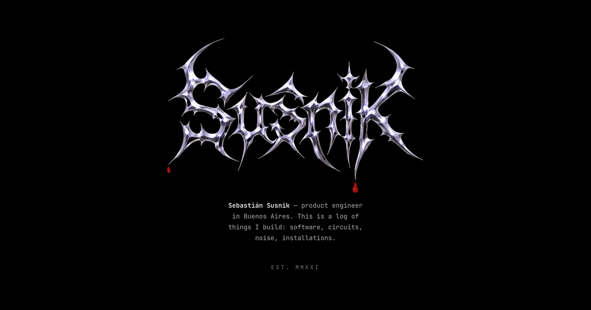

# susnik.dev

A log of things I build — software, circuits, noise, installations — laid out
like a tour poster and set in one monospace typeface. Black, white, and no red
until you touch something.

<p align="center">
  
</p>

## Adding an entry

One markdown file per thing, in `src/content/projects/`. Copy `_template.md`,
rename it, delete `draft: true`. That is the whole workflow.

```yaml
---
title: Luz galería
date: 2026-05-30        # sorts the setlist
kind: hardware          # code | hardware | sound | art | client
status: alive           # alive | undead | deceased   (optional)
summary: LED CCT controller board. ESP32-C3, LD2410 radar, encoder.
link: https://github.com/sebasusnik/luz-galeria
---
```

**Leave the body empty and the row links straight out to `link`** — a repo
README usually says more than a page repeating it. **Write a body and the entry
gets its own page** at `/projects/<file-name>/`, which is what you want for an
installation with photos and video.

A few fields exist for the ones that do not fit a date and a status:

| Field        | For                                                          |
| :----------- | :----------------------------------------------------------- |
| `dateLabel`  | When the date alone lies: `∞`, `2024 —`                       |
| `died`       | The year, next to `status: deceased`                          |
| `featured`   | The headliner, set bigger at the top. Only one entry          |
| `stack`      | A second line under the summary. Headliner only               |
| `draft`      | Keeps it out of the setlist                                   |

## What is hiding in it

- The logo **dies for a frame** every 15 to 30 seconds, like a neon that is going.
- It **bleeds from its tips**. The tips are found by reading the logo's alpha
  channel, so changing the logo changes where it bleeds. Drops hang, neck, fall,
  hit the floor of the hero and open. They never reach the setlist.
- Typing **`666`** turns the world over, and it starts to pour. The page inverts,
  the logo flips — but gravity does not, so it bleeds from the spikes that now
  point down. Type it again to come back. On a phone, hold the logo.
- **`▶ drone`**, bottom right, synthesises a sustained sub-bass D. **Scrolling
  disturbs it**: speed opens the filter, so the saws bare their harmonics when
  you move and sink back when you stop. Position is deliberately not mapped to
  pitch — that reads as a DJ, not as dread. It never autoplays and there is
  nothing to download. Wear headphones; at rest it all lives below 80 Hz.
- Turning the world over **stings** — a noise transient, a dissonant cluster
  sliding flat, a sub thump. Only on the way in, and only ever after you typed
  `666` or held the logo, so it is never sound nobody asked for. It ducks the
  drone rather than piling on top of it.
- The tab **calls you back** when you leave, and there is a note in the console.

All of it is skipped when `prefers-reduced-motion` is set.

## The terminal

The previous version of this site was a draggable terminal window. It still
runs, at [`/terminal`](https://susnik.dev/terminal). Type `help`, or press Tab.

## Running it

```sh
npm install
npm run dev          # http://localhost:4321
```

Astro and Tailwind, with React only on the terminal page. The six theme colours
are CSS variables that `tailwind.config.cjs` points at, so `666` repaints the
whole site by swapping six values rather than filtering it — a filter turned the
blood pink. The blood itself is a few hundred lines of canvas in
`src/scripts/blood.ts`.

## Two things you have to supply

- **`public/resume.pdf`** — the footer's `cv` link and the terminal's `resume`
  command both point at it, and 404 without it.
- **Absolute URLs** for the canonical link and `og:image` come from
  `VERCEL_PROJECT_PRODUCTION_URL`, which Vercel points at the production domain.
  `PUBLIC_SITE_URL` overrides it; local builds fall back to localhost.
