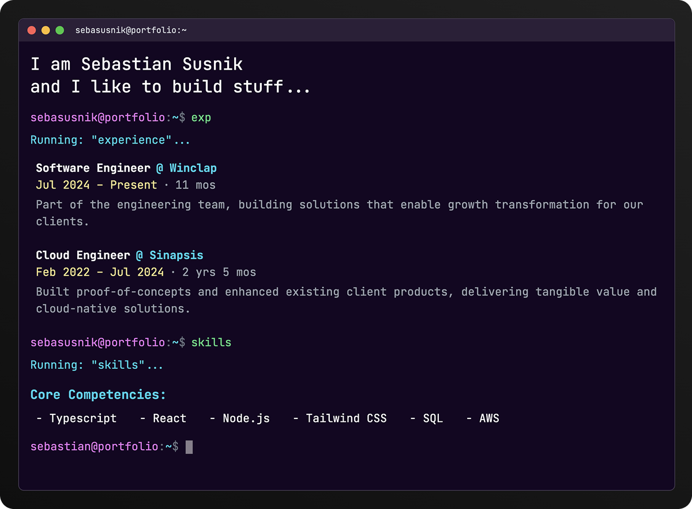

# Portfolio Terminal

This is a personal portfolio reimagined as an interactive, draggable terminal window. Built with Astro, React, and Tailwind CSS, it offers a unique way to explore my projects, skills, and contact information through a command-line interface.

<p align="center">
  
</p>

## ✨ Features

- **Interactive Terminal UI**: A familiar command-line interface for navigating the portfolio.
- **Draggable & Resizable Window**: The terminal can be moved and resized like a native application window, thanks to `react-draggable` and `re-resizable`.
- **macOS-like Controls**: Classic red, yellow, and green window buttons for an authentic feel.
- **Command-Based Navigation**: Use simple, intuitive commands to explore different sections.
- **Command History**: Cycle through previously entered commands using the up and down arrow keys.
- **Responsive Design**: Adapts smoothly to various screen sizes.

## 🚀 Tech Stack

- **Framework**: [Astro](https://astro.build/)
- **UI Library**: [React](https://reactjs.org/) with [TypeScript](https://www.typescriptlang.org/)
- **Styling**: [Tailwind CSS](https://tailwindcss.com/)

## 🧞 Available Commands

All commands are run from the terminal prompt:

| Command   | Action                                      |
| :-------- | :------------------------------------------ |
| `about`   | Displays a brief introduction about me.     |
| `exp`     | Lists my professional experience.           |
| `skills`  | Shows a list of technical skills.           |
| `contact` | Provides ways to get in touch.              |
| `help`    | Shows this list of available commands.      |
| `repeat`  | Replays the intro animation.                |
| `clear`   | Clears all output from the terminal screen. |

A couple of undocumented commands are in there too — try the ones you would
reach for in a real shell.

## 🛠️ Getting Started

To run this project locally:

1.  **Clone the repository:**
    ```sh
    git clone <your-repo-url>
    cd <repo-folder>
    ```

2.  **Install dependencies:**
    ```sh
    npm install
    ```

3.  **Start the development server:**
    ```sh
    npm run dev
    ```

The application will be available at `http://localhost:4321`.
